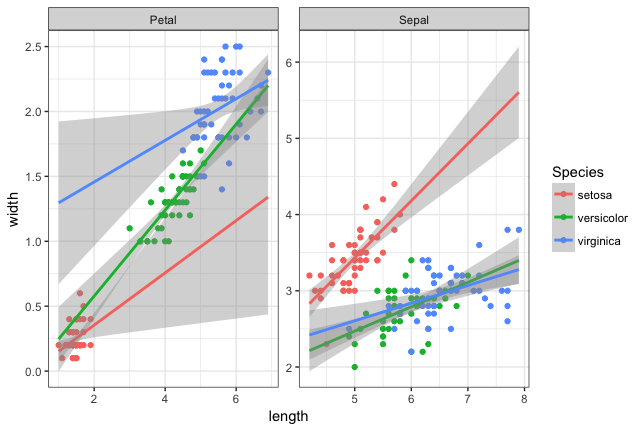

```{r setup, include=FALSE}
knitr::opts_chunk$set(echo = TRUE, cache=TRUE)
library(tidyverse)
```

##Homework 1 - to be done as groups
Names:

Group:

For deadlines etc, see absalon. 

You have to supply both the answer (whatever it is: numbers, a table, plots or combinations thereof), as well as the R or Linux code you used to make the plots. This should be done using this R markdown template: we want both the R markdown file and a resulting PDF. For PDF output, you may have to install some extra programs - R studio will tell you. 

Note that:

1. If the R code gives different results than your results, you will get severe point reductions or even 0 points for the exercise

2. Some questions may request you to use R options we have not covered explicitly in the course: this is part of the challenge

3. While this is a group work, we expect that everyone in the group will have understood the group solution: similar or harder question might show up in the individual homework. So, if something is hard, it means you need to spend more time on it

4. The results should be presented on a level of detail that someone else could replicate the analysis. 

For statistical tests, you have to:

1) Motivate the choice of test 

2) State exactly what the null hypothesis is (depends on test!)

3) Comment the outcome: do you reject the null hypothesis or not, and what does this mean for the actual question we wanted to answer (interpretation)?


###Question 1
Install the package babynames and look at the data babynames:

```{r, eval=FALSE}
install.packages("babynames")
```


```{r q1.part1}
library(babynames)
head(babynames)
```

a) List the top 5 female baby names starting with P, regardless of year, as a table. 

Solution: 
We use the `grep` command with the regular expression to get all names staring with P, then arrange by count (n), and take the top 5.
*Question* why does "^P*" not work???
To ignore multiple entries by year for same name we group by name, and take year(s) with the maximum n, if multiple entries are present we take the latest year.

```{r, get top 5 P-names}
top5_tb <- 
babynames %>% 
  filter(grepl(pattern = "^P", x = name, ignore.case = T), sex == "F") %>%
  group_by(name) %>% 
  filter(n == max(n)) %>% 
  filter(year == max(year)) %>% 
  arrange(desc(n)) %>% 
  ungroup() %>% 
  slice(1:5)

top5_tb

```


b) Using the results from a, plot their occurrences as a function of year using a line plot.  Comment on your results. If you get strange results, explain them and/or improve the plot. 

Solution:
```{r, fig.width=12}
top5_names <- top5_tb %>% pull(name)

babynames %>% 
  filter(name %in% top5_names, sex == "F") %>%
  ggplot(aes(x = year, y = n, col = name)) + geom_line() + scale_y_continuous(trans = "log10")


```


##Question 2
In the same dataset, is the name Arwen significantly more (or less) common in 2004 vs 1990? Is the change significant? What is the likely cause? Do not use hard-coding. 

We frame the question statistically as to test whether: 

$$ P_{Arwen, 1990} = P_{Arwen, 2004}  $$ 

Where $P_{name,year}$ is the probability that a newborn baby-girl will be baptized: "name" during "year".
Our plan is to make a contingency table, with Name: "Arwen" / "Not Arwen" as one variable, and Year: "1990" and "2004" at the other category. From the contingency table we can use Fisher's Exact Test, which strictly speaking will test the hypothesis:

$$
H_0: \theta = 1
$$
Where $\theta$ is the odds ratio of being called Arwen in 1990 resp. 2004. Conditioning on the margins, Fisher's exact test then gives the p-value of this hypothesis, which we will test two-sided, as we have no concern for whether the odds have de- or increased, rather whether they have changed.

To not inflate the numbers, and to assure fair comparison we need to total numbers of females for each of the two years. Since data only containes names with >= 5 counts, the proportions given in variable `prop` does not add to 1. 
hence we divided the sum of n with the sum of prop, to normalise and get the underlying total number of females in the population for each year.


```{r}
pop_data <- 
babynames %>% 
  filter(year %in% c(1990, 2004), sex == "F") %>% 
  group_by(year, sex) %>% 
  summarise(n_total_in_data = sum(n), 
            prop_in_data = sum(prop), .groups = "drop") %>% 
  mutate(n_pop = round(n_total_in_data / prop_in_data)) %>% 
  select(year, n_pop)


con_table_tmp <- 
babynames %>% 
  filter(year %in% c(1990, 2004), name == "Arwen") %>% 
  left_join(pop_data, by = c("year")) %>% 
  mutate(n_not_arwen = n_pop - n) %>% select(year, n, n_not_arwen)


con_table <- as.data.frame(x = as.matrix(con_table_tmp[ ,c("n", "n_not_arwen")]), 
                           row.names = con_table_tmp[["year"]]) 

con_table
```

We now do fishers test

```{r}
#Fisher test
fisher.test(con_table)

#Sample Odds ratio as seen in output
(10*2016403) / (166*2053979)

```

The test clearly rejects the null-hypothesis, and we also see from the sample odds-ratio that the odds of being names Arwen in 1990 is only 6% of the corresponding odds in 2004. Which also makes sense since the total population remains more or less the same in the two years, but the cases of Arwen goes from 10 to 166.


##Question 3
Produce the following plot starting from the flowers dataset. A potentially useful function that you may not have seen: bind_rows():  merges two tibbles by rows so that the joint tibble  becomes longer, not wider



##Question 4
We are given a file with binding sites of a certain transcription factor, made with the ChIP-seq technique (you will hear a lot more about the technique later in the course) by a collaborator. 
In the homework directory, there is a data file 'chip_mm5.txt' from the collaborator, representing binding sites from a Chip-chip experiment, with a column for  chromosome, start, end, and score, where score is how 'good' the binding is. Our collaborator has two hypotheses:

1: Binding scores are dependent on chromosome

2: Binding site widths (end-start) are dependent on chromosome

Can you prove/disprove these two hypotheses statistically?

